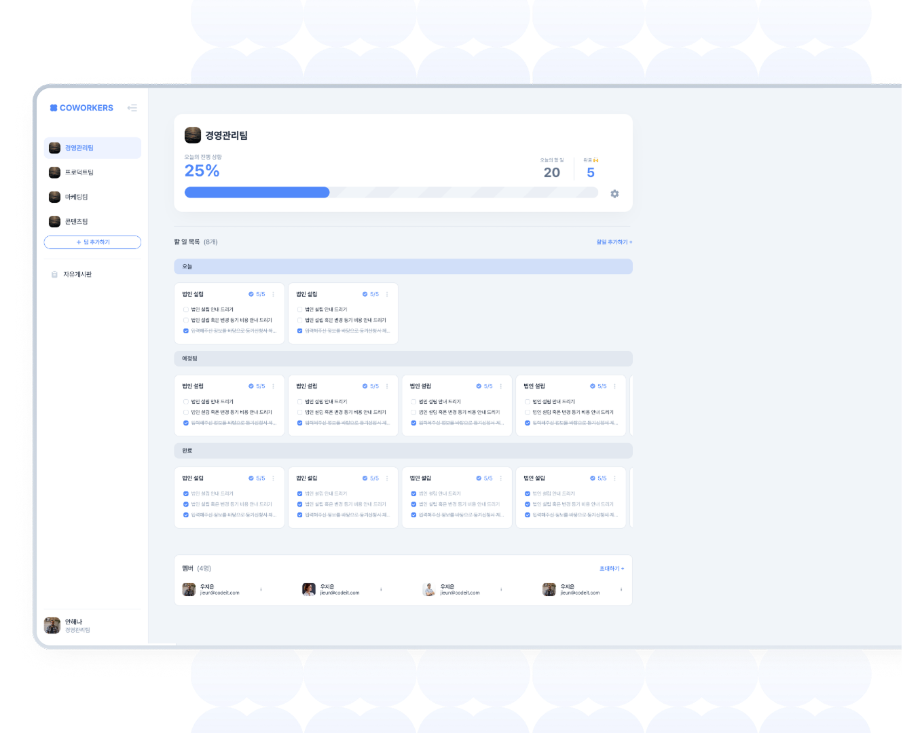
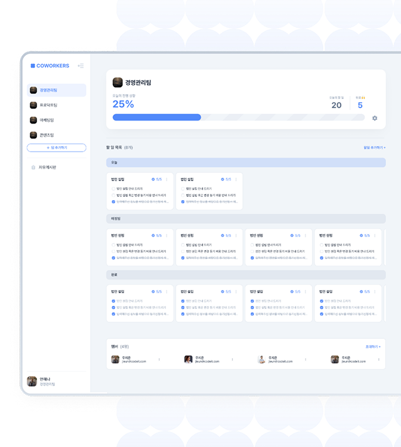
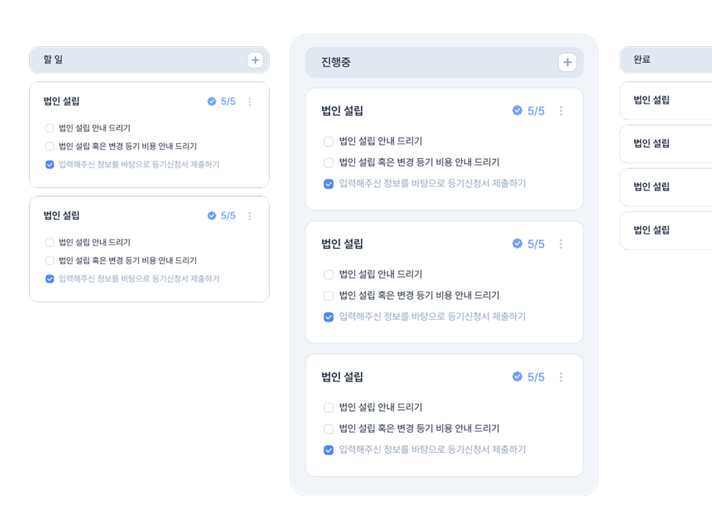
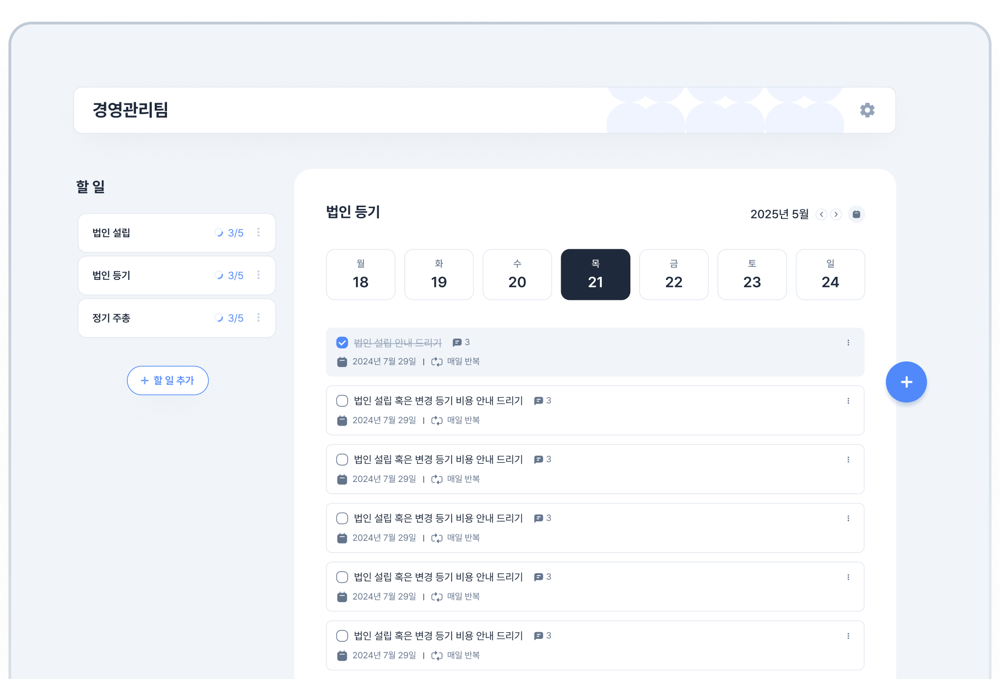
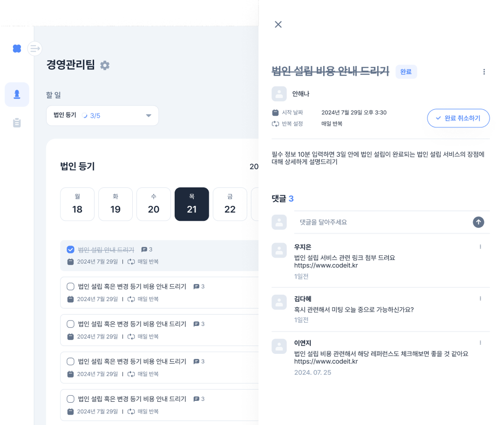

# <p align="center"> Coworkers </p>

### 

### <p align="center"> 함께 만들어가는 To do list — 팀 협업 할 일 관리 서비스 </p>

<br>

## 📋 Table of Contents

- [About](#-about)
- [Demo](#-demo)
- [Main Features](#-main-features)
- [Tech Stack](#-tech-stack)
- [API Domains](#-api-domains)
- [CI / CD](#-ci--cd)
- [How to Start](#-how-to-start)
- [Directory Structure](#-directory-structure)
- [Convention](#-convention)

<br>

## 📖 About

**Coworkers**는 팀원과 함께 할 일을 관리하고, 진행 상황을 공유하며, 자유게시판으로 소통할 수 있는 협업 웹 애플리케이션입니다.

- 칸반보드 기반 **할 일 목록 · 세부 할 일** 관리
- **댓글**을 통한 진행 상황 공유 및 피드백
- **팀 생성 · 참여 · 수정** 및 멤버 관리
- **자유게시판** (글 작성, 수정, 좋아요, 댓글)
- **카카오 OAuth** 소셜 로그인
- **마이 히스토리** 및 **계정 설정**

<br>

## 🎥 Demo

|                                    **랜딩 페이지**                                     |                                      **칸반보드**                                      |
| :------------------------------------------------------------------------------------: | :------------------------------------------------------------------------------------: |
|  |  |
|                                     **할 일 체크**                                     |                                  **댓글 · 의견 공유**                                  |
|     |      |

<br>

## ✨ Main Features

|      구분      | 설명                                                                |
| :------------: | :------------------------------------------------------------------ |
|  **팀 관리**   | 팀 생성, 초대 코드로 참여, 팀 정보 수정, 멤버 역할 관리             |
| **할 일 관리** | 칸반보드 형태의 목록 관리, 세부 할 일 추가 · 수정 · 삭제, 반복 일정 |
|    **협업**    | 할 일별 댓글, 진행률 표시, 팀원별 업무 현황                         |
| **자유게시판** | 게시글 CRUD, 좋아요, 댓글                                           |
|    **인증**    | 이메일 로그인 · 회원가입, 카카오 OAuth, 비밀번호 재설정             |
| **마이페이지** | 프로필 수정, 비밀번호 변경, 계정 삭제, 나의 할 일 히스토리          |

<br>

## 🛠 Tech Stack

<br>

<div align="center">

|         분야          | 사용 기술                                                                                                                                                                                                                                                                                                                                                                                                                                                                                                                     |
| :-------------------: | :---------------------------------------------------------------------------------------------------------------------------------------------------------------------------------------------------------------------------------------------------------------------------------------------------------------------------------------------------------------------------------------------------------------------------------------------------------------------------------------------------------------------------- |
|       **Core**        |                                                                                                                                                                                                    |
|      **Styling**      |                                                                                                                                                                                                                                                                                                                                                                                                         |
|   **State & Data**    |                                                                                                                                                                                              |
| **Form & Validation** |                                                                                                                                                                                                                                                                                                     |
|     **Test & DX**     |                                                                                                                                                                                           |
|   **Code Quality**    |                                                                                                                                                                                                             |
|  **Deploy & Infra**   |                                                                                          |
|   **Collaboration**   |      |

</div>

<br>

## 💻 API Domains

프론트엔드는 `NEXT_PUBLIC_API_BASE_URL` 기준 REST API와 통신합니다.

|      도메인      | 설명                        |
| :--------------: | :-------------------------- |
|      `auth`      | 로그인, 회원가입, 토큰 갱신 |
|     `oauth`      | 카카오 OAuth                |
|      `user`      | 사용자 정보, 멤버십 조회    |
|     `group`      | 팀(그룹) CRUD, 멤버 관리    |
|    `taskList`    | 할 일 목록(칸반 컬럼)       |
|      `task`      | 세부 할 일 CRUD             |
|    `comment`     | 할 일 댓글                  |
|   `recurring`    | 반복 일정                   |
|    `article`     | 자유게시판 게시글           |
| `articleComment` | 게시글 댓글                 |
|     `image`      | 이미지 업로드               |

<br>

## 🔬 CI / CD

|   항목   | 내용                                                                                 |
| :------: | :----------------------------------------------------------------------------------- |
|  **CI**  | PR 및 `dev` 브랜치 push 시 Typecheck · Lint · Test · Storybook Build · Next.js Build |
| **E2E**  | Playwright smoke test (GitHub Actions)                                               |
|  **CD**  | `main` 브랜치 push 시 AWS EC2에 Docker Compose 기반 자동 배포                        |
| **품질** | Lighthouse 성능 점검, Gemini PR Code Review                                          |

<br>

## 🚀 How to Start

### Requirements

- Node.js `>= 24.0.0`
- npm `>= 11.15.0`

### Clone & Install

```bash
git clone https://github.com/23-FrontEnd-FinalProject-Team4/frontend.git
cd frontend
npm ci
```

### Environment Variables

프로젝트 루트에 `.env.local` 파일을 생성합니다.

```env
NEXT_PUBLIC_API_BASE_URL=

# Kakao OAuth
KAKAO_REST_API_KEY=
KAKAO_REDIRECT_URI=

# Optional
NEXT_PUBLIC_ENABLE_REACT_QUERY_DEVTOOLS=false
```

### Run Development Server

```bash
npm run dev
```

브라우저에서 [http://localhost:3000](http://localhost:3000) 으로 접속합니다.

### Other Scripts

```bash
npm run build          # 프로덕션 빌드
npm run start          # 프로덕션 서버 실행
npm run lint           # ESLint
npm run test           # Vitest
npm run storybook      # Storybook (http://localhost:6006)
```

### Docker

```bash
docker compose up -d --build
```

Nginx · Certbot 설정은 `docker-compose.yml` 및 `data/` 디렉토리를 참고하세요.

<br>

## 📚 Directory Structure

<details>
  <summary><b>Frontend</b></summary>

```text
📦 frontend
┣ 📂 .github
┃ ┣ 📂 ISSUE_TEMPLATE
┃ ┣ 📂 workflows          # CI, Deploy, Playwright, Gemini Review
┃ ┗ 📜 PULL_REQUEST_TEMPLATE.md
┣ 📂 docs/convention      # 팀 컨벤션 문서
┣ 📂 public
┣ 📂 src
┃ ┣ 📂 app                # Next.js App Router
┃ ┃ ┣ 📂 (landing)        # 랜딩 페이지
┃ ┃ ┣ 📂 (auth)           # 로그인, 회원가입, OAuth, 비밀번호 재설정
┃ ┃ ┣ 📂 (protected)      # 인증 필요 페이지
┃ ┃ ┃ ┣ 📂 [teamId]       # 팀 홈, 할 일 목록
┃ ┃ ┃ ┣ 📂 articles       # 자유게시판
┃ ┃ ┃ ┣ 📂 my-history     # 나의 할 일 히스토리
┃ ┃ ┃ ┣ 📂 settings       # 계정 설정
┃ ┃ ┃ ┗ 📂 (team)         # 팀 생성 · 참여 · 수정
┃ ┃ ┣ 📜 layout.tsx
┃ ┃ ┗ 📜 globals.css
┃ ┣ 📂 apis               # Axios API 함수 (도메인별)
┃ ┣ 📂 components         # 공통 UI 컴포넌트
┃ ┣ 📂 queries            # TanStack Query hooks
┃ ┣ 📂 stores             # Zustand stores
┃ ┣ 📂 hooks
┃ ┣ 📂 utils
┃ ┣ 📂 schemas
┃ ┣ 📂 providers
┃ ┣ 📂 lib                # clientFetcher, serverFetcher
┃ ┣ 📂 assets
┃ ┃ ┣ 📂 icons
┃ ┃ ┗ 📂 images
┃ ┗ 📂 constants
┣ 📂 tests                # Playwright E2E
┣ 📂 .storybook
┣ 📜 Dockerfile
┣ 📜 docker-compose.yml
┣ 📜 next.config.ts
┣ 📜 package.json
┗ 📜 README.md
```

</details>

<br>

## 📌 Convention

팀 개발 컨벤션은 [`docs/convention/`](./docs/convention/) 디렉토리에서 확인할 수 있습니다.

|                                    문서                                     | 내용                     |
| :-------------------------------------------------------------------------: | :----------------------- |
| [01-기술-스택-및-개발-환경](./docs/convention/01-기술-스택-및-개발-환경.md) | 기술 스택, 개발 도구     |
|            [02-네이밍-규칙](./docs/convention/02-네이밍-규칙.md)            | 파일 · 변수 네이밍       |
|            [03-브랜치-전략](./docs/convention/03-브랜치-전략.md)            | Git 브랜치 · 커밋 컨벤션 |
|          [04-디렉토리-구조](./docs/convention/04-디렉토리-구조.md)          | 폴더 구조 가이드         |
|            [05-그라운드-룰](./docs/convention/05-그라운드-룰.md)            | 팀 그라운드 룰           |

<br>

## 🔗 Links

- **Repository**: [23-FrontEnd-FinalProject-Team4/frontend](https://github.com/23-FrontEnd-FinalProject-Team4/frontend)
